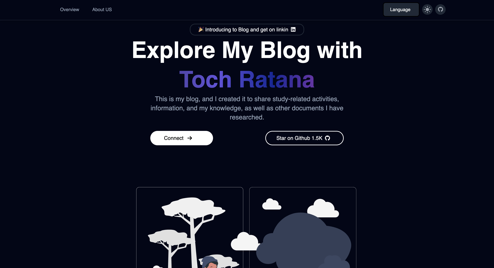

<div align="center">
	
</div>
<h4 align="center">React.js and Tainlwindcss</h4>
<h1 align="center">DevMentor_learning</h1>
The platform tech or intoduce about technology and also we have a source code for you download some of project like e-commerce, Portfolio, game.
<h1 align="center">Toch Ratana's <span style="color:#4c1d95;">Blog</span></h1>

This project is a my blog and I create it for share some of knowlange that I have resarch and technology I use, some of projects I create also I put it in this website to download so you can check it more if you want ot connect me, please <a src="https://tochratana.netlify.app/connect">DM</a>

# Authors

- [@tochratana](https://www.github.com/tochratana)
- [YouTube](https://www.youtube.com/@devmentor-learning)

# Getting Start

## Dependencies

#### React routor

```bash
npm install react-router-dom
npm install localforage match-sorter sort-by
```

#### React flobite

```bash
npm i flowbite-react
```

#### Tailwindcss

```bash
npm install -D tailwindcss
npx tailwindcss init
```

#### Vite

```bash
npm create vite@latest
```

## Run

#### Install node_module

```bash
npm install
```

#### Run

```bash
npm run dev
```

## Versions

- Version 1
  - Create a web page contain Education Profile and project
  - Have a documentation of [React](https://tochratana.netlify.app/course/react-course)
- Version 2
  - Add JavaScript and some of exercises or project open sources
  - CSS documentation and exercises

## Source code of exercise or projects

- [Amazone clone](https://tochratana.netlify.app/course/javascript/exercise/amazone_project)
- [Heart](https://tochratana.netlify.app/course/css/css_exercise/heart_exercise)
