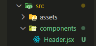

# Usage components in react

After we install [React](#) already In src folder we will see `App.css` `App.jsx` `index.css` `main.jsx` this folder created by [React](#) so in filder `main.jsx` use for rander code frontend and `App.jsx` use for store all component and component we will create it in folder `src` like this

and all component should be with name Capital letter
